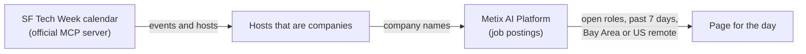

# Job board

Hiring lists built from the [Metix AI Platform](https://platform.metix.ai/?via=tw-sf26).

## SF Tech Week 2026

For each day of [SF Tech Week](https://www.tech-week.com/calendar/sf) (October 5 to 11), the companies hosting events that day that posted new Bay Area or US-remote roles in the past 7 days, with their events and every role. Each page shows the same list two ways: by time, where each event opens to the hosts hiring there, and by company, where each host opens to its events that day and its roles.

| Day | Page |
| --- | --- |
| Monday, Oct 5 | [tech-week-2026/sf/mon](https://metixai-official.github.io/job-board/tech-week-2026/sf/mon) |
| Tuesday, Oct 6 | [tech-week-2026/sf/tue](https://metixai-official.github.io/job-board/tech-week-2026/sf/tue) |
| Wednesday, Oct 7 | [tech-week-2026/sf/wed](https://metixai-official.github.io/job-board/tech-week-2026/sf/wed) |
| Thursday, Oct 8 | [tech-week-2026/sf/thu](https://metixai-official.github.io/job-board/tech-week-2026/sf/thu) |
| Friday, Oct 9 | [tech-week-2026/sf/fri](https://metixai-official.github.io/job-board/tech-week-2026/sf/fri) |
| Weekend, Oct 10 to 11 | [tech-week-2026/sf/weekend](https://metixai-official.github.io/job-board/tech-week-2026/sf/weekend) |

Pages for later days go up early, filled with the newest market data available and marked "Early look". Each one is refreshed once the Platform has postings through the day before.

## How it's built



Hosts are companies with an event on the official SF Tech Week calendar that day. Universities, student groups, community and media organizers, accelerators, government offices and individuals are left out.

Roles come from the Metix AI Platform, which aggregates public job postings from many sources. Each list keeps only open roles posted in the 7 days before the pull, in Bay Area cities or listed as US remote (the posting names the United States but no city). The same title at the same company is counted once. Job types come from keywords in the title, so some will be wrong.

The lists are for information only and may be incomplete or out of date. Confirm a role on the employer's own posting before you apply.

A step-by-step prompt to rebuild a day's list with your own agent, through the Tech Week MCP server and the Metix AI Platform, is coming this week, after we have run it end to end and measured what it costs.

## Build a page

Python 3.12. Rendering uses only the standard library; the share image needs Playwright.

```sh
python -m jobboard site tech-week-2026/sf --day mon
```

The day's data is in `boards/tech-week-2026/sf/days/`. Pages are written to `docs/`, which GitHub Pages serves. Tests:

```sh
python -m pip install -e ".[dev]"
python -m pytest
```

## Data and licensing

Code is under Apache-2.0 ([LICENSE](LICENSE)). Text and the compiled lists are under CC BY 4.0 ([LICENSE-CONTENT](LICENSE-CONTENT)). Event details belong to their hosts and the SF Tech Week calendar; job postings belong to their employers.

This is an independent list, not affiliated with or endorsed by Tech Week or a16z.

Something wrong or missing? [Open an issue](https://github.com/MetixAI-Official/job-board/issues/new?title=Correction%3A%20).

Copyright 2026 OpenJobs AI Inc. Metix AI Platform is a product of OpenJobs AI Inc.
